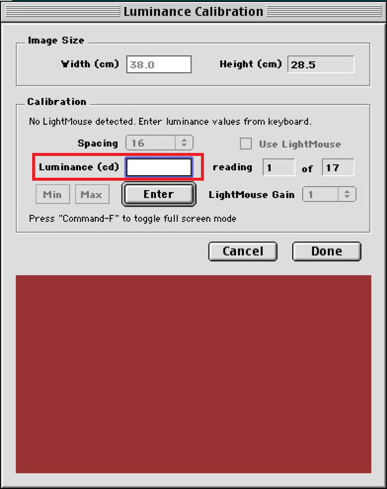

#Calibrate Monitor
##EEG
### Prepare Computers
- In 120H Switch on power of large surge protector on bottom left shelf.

- Switch on power of smaller, thin surge protector on second shelf (ignore lights; always on).

- Turn on **PD Video**, **NetStation** and **Link 15** computers, and both monitors.

  - If either monitor screen is unresponsive, you may need to toggle to the correct computer via the gray KVM switches on the top left (PD Video / Link 15) and right (NetStation  / PD Host) shelf.

- Turn on external timebase, behind the monitors (switch is back, right side).

- Remove the plug from the external timebase outlet labeled **OUT**. (Clock Out stays in).  - What is this for alibration
 

- Make sure that white round switch on top of the left KVM switch is set to B.

- On PD Video computer, open Power Diva Video 3.4 software. (icon label says alias)

 
- In Power Diva Video, go to Configuration > Video Manager. In **Mode** window, make sure the calibrated video setting is selected: 

	- 800 x 600, 72 Hz, 8 bit

 
   

- Choose **Cancel**

### Prepare Light Meter

### Start Calibrating Luminance

- Click **Calibrate Lum**  

 

- Enter the Monitor Screen Width in centimeters
- Select **Start**
-  

- 

##MRI

### Prepare scan room

### Prepare Light Meter

### Run Matlab Script

### Log values
