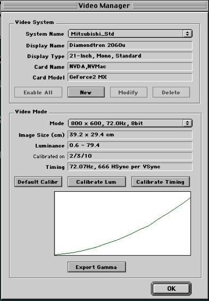
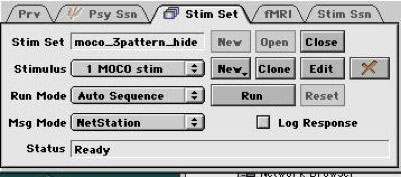
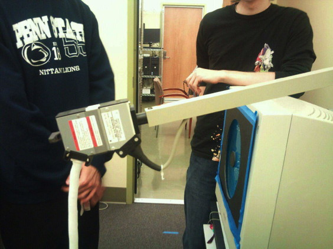

# High-Density VEP Set-Up Checklist

## Monitor
- Turn on the **CRT monitor** on the cart in 120G

## AMPLIFIER

- In 120G Chandlee remove cables from amplifier and connect them to pegs on wall.
 

- Wheel amp between the monitor and the subject chair so that it is to the right of the subject chair. 
  **ALWAYS PULL AMP BACKWARDS TO PREVENT TIPPING**

- Plug the 4 cords from the wall ports connecting rooms G and H into respective ports (Digital input, USB, and TTL input external timebase) of the amplifier. Turn power on 
(I = on).

 
## COMPUTERS
- Turn on CRT Monitor in room 120G.

- In 120H Switch on power of large surge protector on bottom left shelf.

- Switch on power of smaller, thin surge protector on second shelf (ignore lights; always on).

- Turn on PD Video and NetStation computers, and both monitors.

- If either monitor screen is unresponsive, you may need to toggle to the correct computer via the gray KVM switches on the top left (PD Video / Link 15) and right (NetStation  / PD Host) shelf.

- Turn on external timebase, behind the monitors (switch is back, right side).

- Remove the plug from the external timebase outlet labeled OUT. (Clock Out stays in).
 

- Make sure that white round switch on top of the left KVM switch is set to B.

- On PD Video computer, open Power Diva Video 3.4 software. (icon label says alias)

 
- In Power Diva Video, go to Configuration --> Video Manager. In "Mode" window, make sure the calibrated video setting is selected: 

	- "800 x 600, 72 Hz, 8 bit" is a common mode. 
 
 

- In Run mode (pull-down tab), choose Auto Sequence. In Msg mode (pull-down tab), choose Net Station.
 
- Go to Open, and choose the appropriate stimulus set.

- Press the Run button. In the DAQ Rate Settings window, there is a binary code to confirm. On the side of the external time box facing you, there are silver switches (up = 1, down = 0). Read the binary code in the PD Video window from right to left, and check to make sure that the switches on the timing box correspond to this code. If they don't match, notify the PI. If they do, press Cancel.

- Go to the Net Station computer and log in with the gilmorelab account (w/ lab password - 0baby- ).
	
- In the dock at the bottom of the screen, click on the icon for Net Station (purple icon) to open the program.
 

- When the window pops up, there should be a key symbol with the words “Wenger 5” on the bottom left-hand side. If it is not there, this means that the NS HASP key is not plugged in.

- In the Net Station window, click New Session, and select the session template labeled Power Diva Adult Set Up.
	 

## AFTER PARTICIPANT ARRIVES

- Enter participant ID, date of birth, experiment name, and net serial number. Lab uses the following standard ID number for each session: YYMMDD_HHMM.

- Begin Session.

- Run Zeros and Gains (should run automatically).

  
- After netting, plug the articulating arm into the amp, and the net into the articulating arm.

- Measure Impedance. Adjust channels as necessary. Save and close when satisfactory.

- Choose Dense Waveform Display in the Panels window of Net Station.

- Turn small switch on amplifier to “External Time Base.”

- In Power Diva Video, press the Run button. Check off the box in the Net Station Recording control window labeled “Start/Continue Net Station Recording,” and press Run.

- On the Net Station computer, make sure the “Recording” symbol is displayed on the upper left-hand side of the screen. Also, make sure the event flag labeled “DIN4” is present, as well as a flag below this with the condition number (e.g., “c004”).

## AFTER SESSION

- Once recording is complete, select the close session button on the Net Station computer (this saves the session).

- Return computers and other devices to their default settings.

- Return and replug amplifier to its default setup.

- Clean net and begin [data export](ssvep-data-export.md) (separate protocols).

