# High-Density VEP Set-Up Checklist

# Before Participant Arrives

## EEG Net Preparation  
- Make electrolyte solution
  - Warm 1L water in microwave for 1 minute.
  - Add in Potassium Chloride (2 tsp) and Baby Shampoo (1 tsp)

## MONITOR
- Turn on the **CRT monitor** on the cart in 120G

## AMPLIFIER

- In 120G Chandlee remove cables from amplifier and connect them to pegs on wall.
 
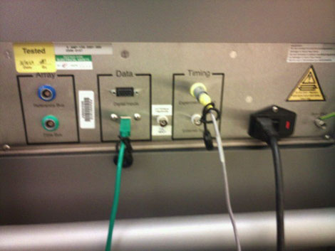

- Wheel amp between the monitor and the subject chair so that it is to the right of the subject chair. 
  **ALWAYS PULL AMP BACKWARDS TO PREVENT TIPPING**

- Plug the 4 cords from the wall ports connecting rooms G and H into respective ports (Digital input, USB, and TTL input external timebase) of the amplifier.  
- TTL Input (BNC cable) must be pushed in all the way and then turned clockwise.
- Turn power on (I = on).

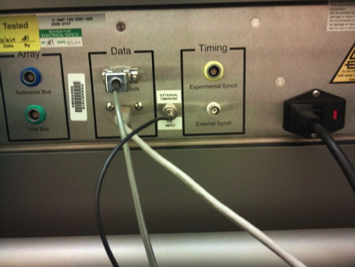

- Turn small switch on amplifier to **NORMAL**
  - If this is on another setting during calibration and impedance check, you will see an error stating that everything is out of specification. 
  - If there is an error, you must begin the setup from step one again.

## COMPUTERS

- In 120H Switch on power of large surge protector on bottom left shelf.

- Switch on power of smaller, thin surge protector on second shelf (ignore lights; always on).

- Turn on **PD Video** and **NetStation** computers, and both monitors.

  - If either monitor screen is unresponsive, you may need to toggle to the correct computer via the gray KVM switches on the top left (PD Video / Link 15) and right (NetStation  / PD Host) shelf.

- Turn on external timebase, behind the monitors (switch is back, right side).

- Remove the plug from the external timebase outlet labeled **OUT**. (Clock Out stays in).
 
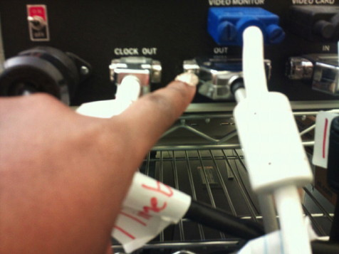

- Make sure that white round switch on top of the left KVM switch is set to B.

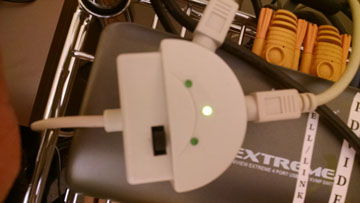

- On PD Video computer, open Power Diva Video 3.4 software. (icon label says alias)

 
- In Power Diva Video, go to Configuration > Video Manager. In **Mode** window, make sure the calibrated video setting is selected: 

	- 800 x 600, 72 Hz, 8 bit
 
   

- Click **OK**  

### Prepare Stimuli

#### For Child and Adult
- In Run mode (pull-down tab), choose **Auto Sequence**. 
- In Msg mode (pull-down tab), choose **Net Station**.
- In Stim Set, Go to Open, and choose the appropriate stimulus set.
  - Child
    - mofo_tuning_child_20150428
  - Adult
    - moco_3pat_hidens_20150428	

  

#### For Infant
- In Run mode (pull-down tab), choose **Baby Mode**. 
- In Msg mode (pull-down tab), choose **Net Station**.
- In Stim Set, Go to Open, and choose the appropriate stimulus set.
  - inf_2pat_lamrad_20150428 (most used)
  - inf_2pat_lamrot_20150428
  - inf_2pat_radrot_20150428

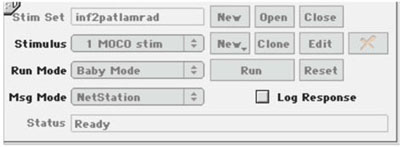 

- Press the **Run** button. In the DAQ Rate Settings window, there is a binary code to confirm. On the side of the external time box facing you, there are silver switches (**up = 1, down = 0**). Read the binary code in the PD Video window from **RIGHT to LEFT**, and check to make sure that the switches on the timing box correspond to this code. If they don't match, notify the PI. If they do, press **Cancel**.

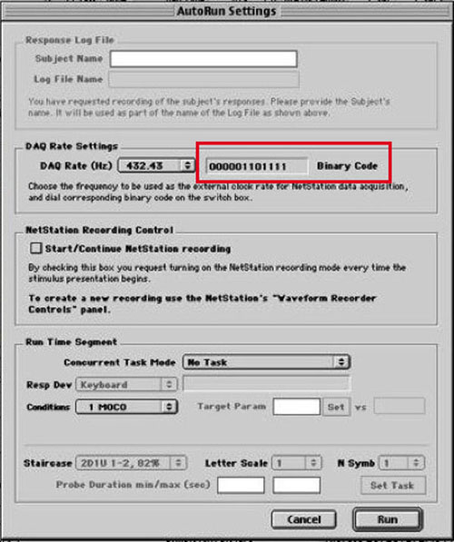 

### Prepare Net Station

- Go to the Net Station computer and log in with the **gilmorelab** account (w/ lab password - **0baby0**).
	
- In the dock at the bottom of the screen, click on the icon for Net Station (purple icon) to open the program.
 

- When the window pops up, there should be a key symbol with the words **Wenger** on the bottom left-hand side. If it is not there, this means that the NS HASP key is not plugged in.

- In the Net Station window, click **New Session**
- Select the session template labeled **Power Diva Setup**.
- Enter participant ID, Experiment Name, Date of birth, and net serial number. Lab uses the following standard ID number for each session: YYMMDDXXXX (TestDateParticipantIDnumber).

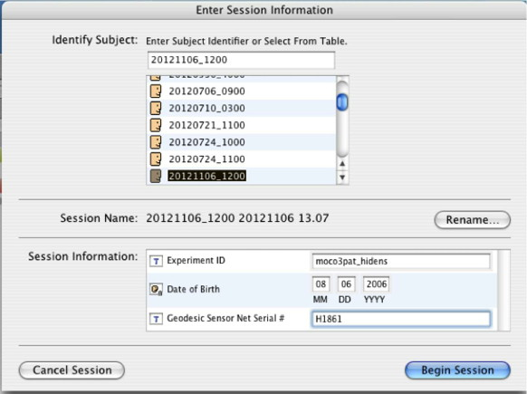

- **Begin Session**.

- Run Zeros and Gains (should run automatically). The net cannot be plugged into the articulating arm at this time.

  
  

## AFTER PARTICIPANT ARRIVES

- Talk with participant to complete the following 
  - Consent Form  
  - Payment Form  
  - Databrary Form (if needed)  
  
- Complete Vision Screening
  - Infant - Snellen Acuity @ XX cm
  - Child - HTOV @ 10ft
  - Adult - HTOV @ 10ft
  
- Prepare EEG Net  
  - Measure Head Circumference  
  - Select proper net based on Head circumference
  - Soak net for 5 minutes in electrolyte solution
  
- Complete [EEG Net Placement](Applying_EEG_Nets_and_Minimizing_Impedances.md). (separate protocol)
  - Angle chair to have more room in the testing chamber. 

- After netting, plug the net into the articulating arm.

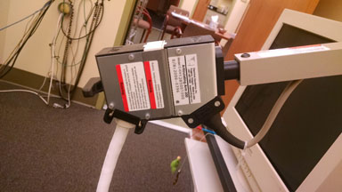

- Measure Impedance
  - Go to the **Panels** menu at the top of the screen and select **Impedance**
  - Then click the **Measure Impedance** button. (Threshold = 50 kohms)
  - Adjust channels as necessary.
    - The person in the computer room needs to tell the person in the testing room which channels need to be adjusted. 
  - Click **Save & Close** when satisfactory.
  - When this is complete, tell the person in the testing chamber that this is done and remind them to turn the switch on the front of the amplifier to 'External Timebase'. 
	
  - If the incorrect impedance check appears, double check that both connectors on the amplifier are securely plugged in.

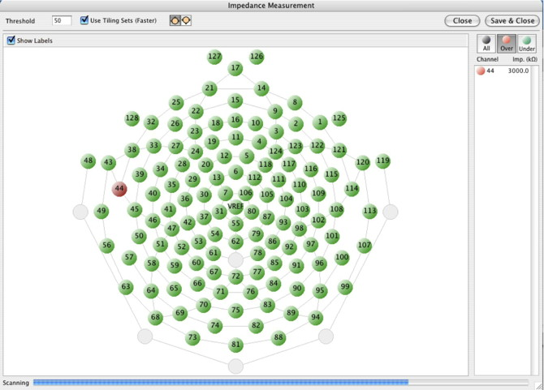

- Turn small switch on amplifier to **EXTERNAL TIMEBASE**.

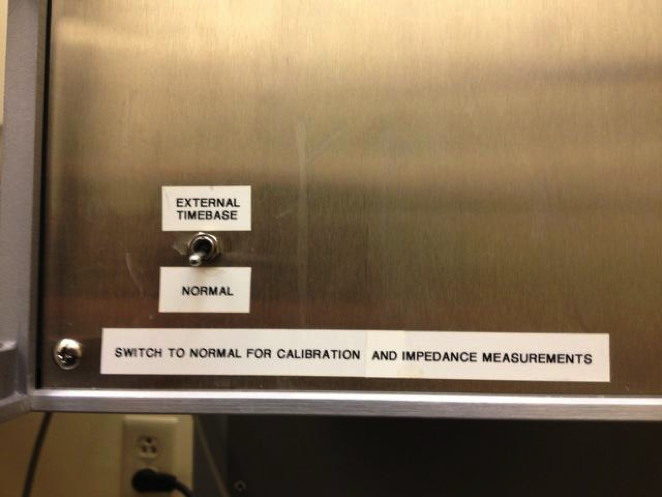

- Go to the **Panels** menu at the top of the screen and select **Dense Waveform Display**.

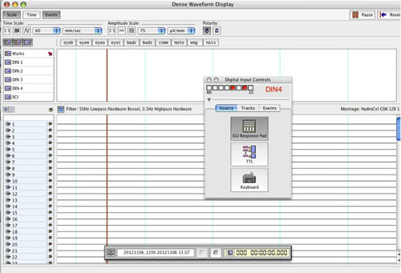

## Experimental Setup

- The monitor should be located 60cm from the bridge of the nose on the participant
- The chair height should be set so the participant is looking directly at the **X** in the middle of the screen.
- High Density
  - Baby Mode (Researcher in the room)
    - Record: Use the Keyboard to record (**R**) 
      - When recording there is an **X** in the middle of the screen.
    - Pause Study: Use the keyboard to pause (**W**)
      - When paused there is an **X** with a **circle** around it in the midde of the screen
    - Use the toys to keep attention toward the monitor
  - Auto Sequence
    - Pause Study: The keyboard **space bar** in the testing chamber or on the PD Video computer
    - Continue Study: The **Continue** button must be clicked in the Power Diva software
- Low Density
  -  Game controller is used to record and pause

## Run Experiment

- In Power Diva Video, press the **Run** button in the **Stim Set** window
- The **Auto Run Settings** window will open
- **Check the box** in the Net Station Recording control window labeled **Start/Continue Net Station Recording**
- Press **Run**.

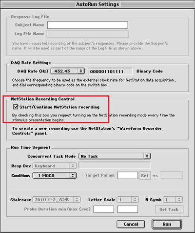

- Try to get the following number of blocks of data:
  - Infant: 3-5
  - Child: 5-10
  - Adult: 8-12
  
- On the Net Station computer, make sure the “Recording” symbol is displayed on the upper left-hand side of the screen. Also, make sure the event flag labeled “DIN4” is present, as well as a flag below this with the condition number (e.g., “c004”).
  - the flag "p003" means that the study was paused

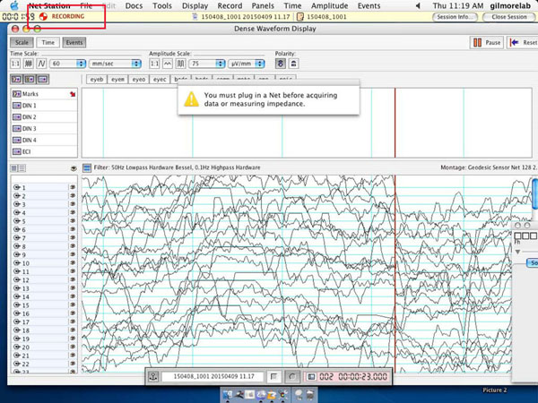

## AFTER SESSION

- Once recording is complete, select the **close session** button on the Net Station computer (this saves the session).

- Return computers and other devices to their default settings.

- Return and replug amplifier to its default setup.

- Clean net and begin [data export](ssvep-data-export.md) (separate protocols).

